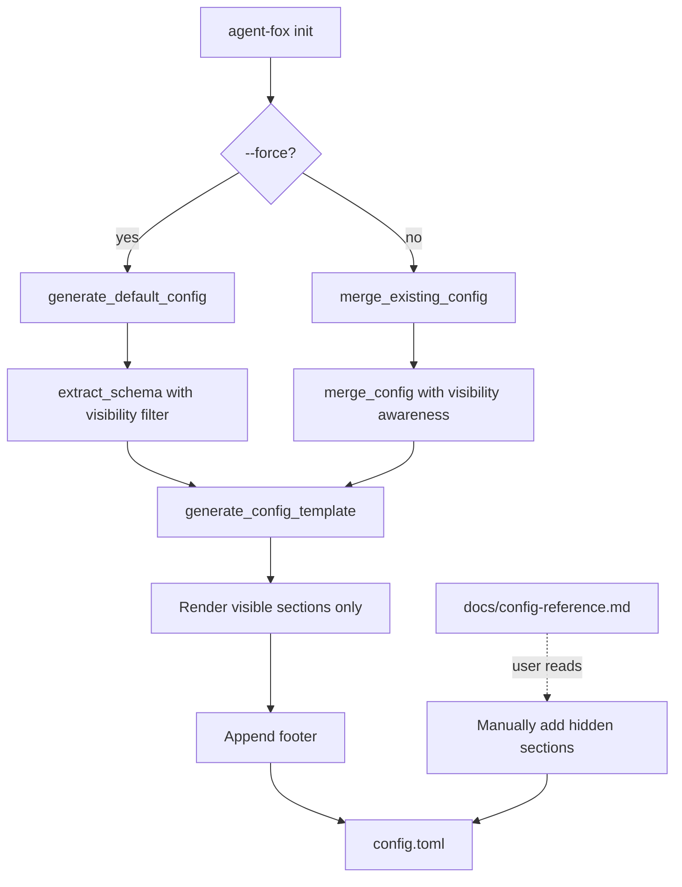

# Design Document: Config Simplification

## Overview

The config simplification replaces the verbose, all-options-shown template with
a focused template containing only essential sections. The implementation
modifies the template generation layer (`config_schema.py`, `config_gen.py`,
`config_merge.py`) without changing config loading, validation, or Pydantic
models. One code default changes: `ArchetypeInstancesConfig.verifier` moves
from `1` to `2`. A new `docs/config-reference.md` provides full documentation.

## Architecture



### Module Responsibilities

1. **`config_schema.py`** — Schema metadata: promoted defaults, visible
   sections set, improved field descriptions.
2. **`config_gen.py`** — Template rendering: visibility filtering, footer
   appending.
3. **`config_merge.py`** — Merge logic: skip adding hidden sections during
   merge.
4. **`config.py`** — Config model: `ArchetypeInstancesConfig.verifier` default
   change.
5. **`docs/config-reference.md`** — Static documentation: full field reference.

## Components and Interfaces

### config_schema.py Changes

```python
# New: set of section paths that appear in the simplified template.
_VISIBLE_SECTIONS: set[str] = {
    "orchestrator",
    "models",
    "archetypes",
    "archetypes.instances",
    "archetypes.thinking",
    "archetypes.thinking.coder",
    "archetypes.thinking.skeptic",
    "archetypes.thinking.verifier",
    "security",
}

# Updated: promoted defaults expanded with quality-biased fields.
_PROMOTED_DEFAULTS: set[tuple[str, str]] = {
    ("orchestrator", "parallel"),
    ("orchestrator", "max_budget_usd"),
    ("orchestrator", "quality_gate"),
    ("models", "coding"),
    ("archetypes", "coder"),
    ("archetypes", "skeptic"),
    ("archetypes", "verifier"),
    ("archetypes", "oracle"),
    ("archetypes", "auditor"),
    ("archetypes.instances", "verifier"),
}

# Updated: improved descriptions that explain purpose, not just name.
_DEFAULT_DESCRIPTIONS: dict[tuple[str, str], str] = {
    ("OrchestratorConfig", "parallel"):
        "Max parallel coding sessions",
    ("OrchestratorConfig", "max_budget_usd"):
        "Per-session budget cap in USD (0 = unlimited)",
    ("OrchestratorConfig", "quality_gate"):
        "Shell command run after each coder session to verify quality",
    ("ModelConfig", "coding"):
        "Model tier for coding tasks: SIMPLE, STANDARD, or ADVANCED",
    ("ArchetypesConfig", "skeptic"):
        "Code review — flags issues before merge",
    ("ArchetypesConfig", "verifier"):
        "Post-code verification — runs tests, checks correctness",
    ("ArchetypesConfig", "oracle"):
        "Spec-drift detection — compares code against specs",
    ("ArchetypesConfig", "auditor"):
        "Test-quality gate — ensures test coverage meets standards",
    ("ArchetypeInstancesConfig", "verifier"):
        "Run multiple verifier instances for deeper coverage",
    # ... remaining descriptions stay or get improved
}
```

### config_gen.py Changes

```python
def generate_config_template(
    schema: list[SectionSpec],
    *,
    visible_only: bool = True,
) -> str:
    """Render config.toml from schema.

    When visible_only=True (default), only sections in _VISIBLE_SECTIONS
    are rendered. Hidden sections are omitted entirely.
    A footer referencing docs/config-reference.md is appended.
    """
    ...

_TEMPLATE_FOOTER = (
    "\n## For all configuration options, see docs/config-reference.md\n"
)
```

### config_merge.py Changes

```python
def merge_config(existing_content: str, schema: list[SectionSpec]) -> str:
    """Merge existing config with schema.

    Hidden sections already present in the existing config are preserved.
    Hidden sections NOT present are NOT added (unlike current behavior
    which adds all missing sections as commented blocks).
    """
    ...
```

### config.py Changes

```python
class ArchetypeInstancesConfig(BaseModel):
    verifier: int = 2  # Changed from 1 to 2
```

## Data Models

### Template Output Format

```toml
## agent-fox configuration
## Uncomment and edit values to customize.

[orchestrator]
## Max parallel coding sessions (1-8)
parallel = 2
## Per-session budget cap in USD (0 = unlimited)
max_budget_usd = 5.0
## Shell command run after each coder session to verify quality
quality_gate = "make check"

[models]
## Model tier for coding tasks: SIMPLE, STANDARD, or ADVANCED
coding = "ADVANCED"

[archetypes]
## Code review — flags issues before merge
skeptic = true
## Post-code verification — runs tests, checks correctness
verifier = true
## Spec-drift detection — compares code against specs
oracle = true
## Test-quality gate — ensures test coverage meets standards
auditor = true

[archetypes.instances]
## Run multiple verifier instances for deeper coverage (1-5)
verifier = 2

[archetypes.thinking.coder]
mode = "adaptive"
budget_tokens = 10000

# [security]
## Additional bash commands to allow (added to built-in allowlist)
# bash_allowlist_extend = []

## For all configuration options, see docs/config-reference.md
```

## Operational Readiness

### Rollout

- The change affects only template generation output; existing configs load
  identically.
- Users re-running `init` in merge mode keep all their values.
- Users running `init --force` get the new simplified template.

### Rollback

- Revert the code changes; no data migration needed.

### Migration

- No migration required. Existing `config.toml` files continue to work.
- The `merge_existing_config()` function handles backward compatibility.

## Correctness Properties

### Property 1: Template Parsability

*For any* generated template output, the output SHALL parse as valid TOML
without errors.

**Validates: Requirements 68-REQ-1.2, 68-REQ-1.E2**

### Property 2: Visible Section Containment

*For any* generated template (with `visible_only=True`), every TOML section
header (active or commented) SHALL reference a section in `_VISIBLE_SECTIONS`.

**Validates: Requirements 68-REQ-1.1, 68-REQ-1.2**

### Property 3: Template Size Bound

*For any* generated template (with `visible_only=True`), the total line count
SHALL be at most 60.

**Validates: Requirements 68-REQ-1.4**

### Property 4: Promoted Field Presence

*For any* generated template, every entry in `_PROMOTED_DEFAULTS` whose section
is in `_VISIBLE_SECTIONS` SHALL appear as an active (uncommented)
`key = value` line.

**Validates: Requirements 68-REQ-2.1, 68-REQ-2.2, 68-REQ-2.3, 68-REQ-2.4,
68-REQ-2.5**

### Property 5: Footer Presence

*For any* generated template (with `visible_only=True`), the template SHALL
contain exactly one occurrence of the footer string referencing
`docs/config-reference.md`.

**Validates: Requirements 68-REQ-6.1**

### Property 6: Merge Preserves User Values

*For any* valid existing config content and any schema, calling
`merge_config(content, schema)` SHALL preserve every active (uncommented)
`key = value` pair from the original content.

**Validates: Requirements 68-REQ-5.1, 68-REQ-1.E1**

### Property 7: Merge Does Not Add Hidden Sections

*For any* existing config that does not contain a hidden section, calling
`merge_config()` SHALL NOT introduce that hidden section (active or commented)
in the output.

**Validates: Requirements 68-REQ-5.3**

### Property 8: Description Quality

*For any* promoted field in the generated template, the description comment
line above it SHALL NOT be identical to the field name with underscores
replaced by spaces (i.e., it must be a real description, not a mechanical
transformation of the field name).

**Validates: Requirements 68-REQ-3.2**

### Property 9: Footer Non-Duplication

*For any* existing config content that already contains the footer comment,
calling `merge_config()` SHALL produce output containing exactly one
occurrence of the footer.

**Validates: Requirements 68-REQ-6.E1**

### Property 10: Default Verifier Instances

*For any* `ArchetypeInstancesConfig` constructed with no arguments, the
`verifier` field SHALL equal `2`.

**Validates: Requirements 68-REQ-2.6**

## Error Handling

| Error Condition | Behavior | Requirement |
|----------------|----------|-------------|
| Existing config invalid TOML | Return existing content unmodified, log warning | 68-REQ-1.E1 |
| Empty existing config | Produce simplified template | 68-REQ-5.E2 |
| Deprecated field in existing config | Mark with `# DEPRECATED:` comment | 68-REQ-5.E1 |
| Missing field description | Use `_DEFAULT_DESCRIPTIONS` fallback | 68-REQ-3.E1 |

## Technology Stack

- Python 3.12+
- Pydantic v2 (config models)
- tomlkit (TOML parsing/manipulation for merge)
- Standard library only for template generation

## Definition of Done

A task group is complete when ALL of the following are true:

1. All subtasks within the group are checked off (`[x]`)
2. All spec tests (`test_spec.md` entries) for the task group pass
3. All property tests for the task group pass
4. All previously passing tests still pass (no regressions)
5. No linter warnings or errors introduced
6. Code is committed on a feature branch and pushed to remote
7. Feature branch is merged back to `develop`
8. `tasks.md` checkboxes are updated to reflect completion

## Testing Strategy

- **Unit tests** verify template generation output: section visibility,
  promoted fields, footer presence, line count, description quality.
- **Property-based tests** (Hypothesis) verify invariants: TOML parsability,
  section containment, merge value preservation, footer non-duplication.
- **Integration tests** verify end-to-end: `generate_default_config()` output,
  merge with existing configs containing hidden sections.
