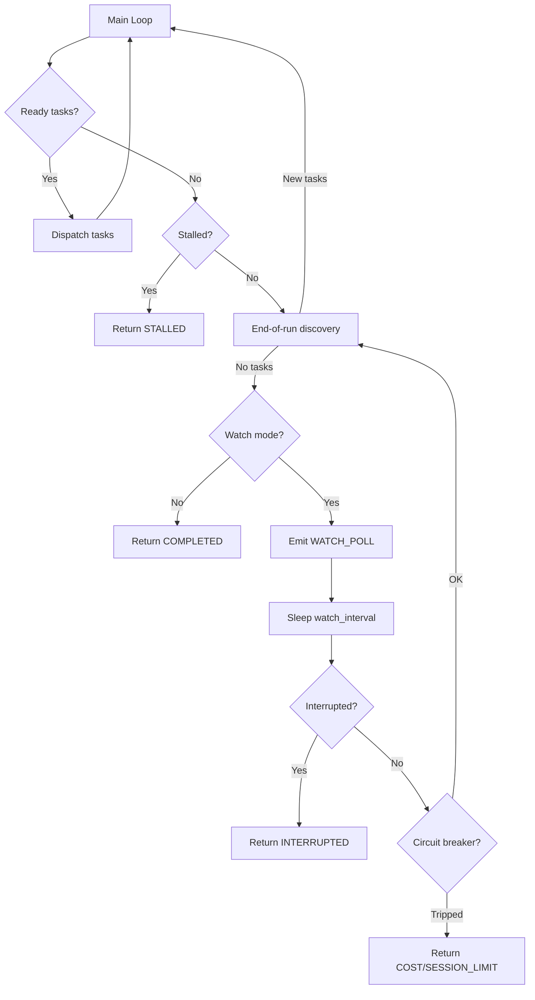

# Design Document: Watch Mode

## Overview

Watch mode adds a sleep-poll loop to the orchestrator's main execution path.
When all tasks complete and watch mode is enabled, the engine sleeps for a
configurable interval, then runs a sync barrier to discover new specs. If new
tasks appear, normal dispatch resumes. If not, the loop repeats.

The change is intentionally minimal: a single new branch in the engine's
COMPLETED path, two new config fields, one CLI flag, and one audit event type.
All polling logic reuses the existing `_try_end_of_run_discovery()` method and
`run_sync_barrier_sequence()`.

## Architecture



### Module Responsibilities

1. **`engine/engine.py`** — Main loop modification: watch loop after COMPLETED
   branch.
2. **`core/config.py`** — `watch_interval` field on `OrchestratorConfig`.
3. **`cli/code.py`** — `--watch` and `--watch-interval` CLI options.
4. **`knowledge/audit.py`** — `WATCH_POLL` enum variant.

## Components and Interfaces

### CLI Options

```python
# cli/code.py additions
@click.option("--watch", is_flag=True, default=False,
              help="Keep running and poll for new specs after all tasks complete")
@click.option("--watch-interval", type=int, default=None,
              help="Seconds between watch polls (default: 60, minimum: 10)")
```

### Config Field

```python
# core/config.py addition to OrchestratorConfig
watch_interval: int = Field(
    default=60,
    description="Seconds between watch polls when --watch is active",
)
```

Clamping validator: values below 10 are silently set to 10.

### Engine Interface

```python
# engine/engine.py — new method on Orchestrator
async def _watch_loop(self, state: ExecutionState) -> ExecutionState:
    """Sleep-poll loop that waits for new specs.

    Runs the sync barrier after each sleep interval. Returns when:
    - New tasks are discovered (caller re-enters dispatch loop)
    - SIGINT is received
    - Circuit breaker trips
    """
```

The method is called from the existing COMPLETED branch:

```python
# Current code (engine.py:514-519):
if await self._try_end_of_run_discovery(state):
    continue
state.run_status = RunStatus.COMPLETED
self._state_manager.save(state)
return state

# New code:
if await self._try_end_of_run_discovery(state):
    continue
if self._watch:
    result = await self._watch_loop(state)
    if result is None:
        continue  # New tasks found — re-enter dispatch loop
    return result  # Terminal state (interrupted, cost limit, etc.)
state.run_status = RunStatus.COMPLETED
self._state_manager.save(state)
return state
```

### Audit Event

```python
# knowledge/audit.py addition to AuditEventType
WATCH_POLL = "watch.poll"
```

Payload schema:

```json
{
  "poll_number": 1,
  "new_tasks_found": false
}
```

## Data Models

### OrchestratorConfig changes

| Field | Type | Default | Description |
|-------|------|---------|-------------|
| `watch_interval` | `int` | 60 | Seconds between watch polls (min: 10) |

### WATCH_POLL audit event payload

| Field | Type | Description |
|-------|------|-------------|
| `poll_number` | `int` | 1-indexed poll count for this run |
| `new_tasks_found` | `bool` | Whether the barrier found new ready tasks |

## Operational Readiness

- **Observability**: Each watch poll cycle logs at INFO level and emits an
  audit event. The poll count is included for correlation.
- **Rollback**: Watch mode is opt-in via CLI flag. Removing `--watch` reverts
  to standard behavior. Config hot-reload can change `watch_interval` mid-run.
- **Migration**: No breaking changes. The `watch_interval` field has a default
  and is ignored when watch mode is not active. The `--watch` flag defaults to
  `false`.

## Correctness Properties

### Property 1: Watch Loop Termination Guarantee

*For any* watch-enabled run with a finite cost limit, the watch loop SHALL
terminate when `total_cost >= max_cost`.

**Validates: Requirements 4.2**

### Property 2: Watch Interval Clamping

*For any* `watch_interval` value V, the effective interval SHALL be
`max(V, 10)`.

**Validates: Requirements 3.2, 3.E1**

### Property 3: Hot-Load Gate

*For any* run where `hot_load` is `False` and `--watch` is set, the system
SHALL terminate with COMPLETED status without entering the watch loop.

**Validates: Requirements 1.2**

### Property 4: Watch Poll Monotonicity

*For any* sequence of WATCH_POLL audit events in a single run, the
`poll_number` values SHALL be strictly monotonically increasing starting
from 1.

**Validates: Requirements 5.2**

### Property 5: Barrier Reuse

*For any* watch poll cycle, the sync barrier sequence called SHALL be the
same function (`run_sync_barrier_sequence`) with the same parameters as used
by mid-run sync barriers.

**Validates: Requirements 2.2**

### Property 6: Stall Overrides Watch

*For any* stalled run with `--watch` enabled, the system SHALL return
`RunStatus.STALLED` without entering the watch loop.

**Validates: Requirements 4.1**

## Watch Loop Implementation Detail

This section specifies the exact internal structure of `_watch_loop()`. The
pseudocode below is **normative** — the implementation and tests must follow
this control flow precisely.

### Critical: Main Loop Discovery Offset

The main dispatch loop calls `_try_end_of_run_discovery(state)` **once** at
line 569 before the watch gate is reached. When tests mock this method on the
orchestrator instance, the mock's call counter is already at 1 by the time
`_watch_loop` executes. All test mocks must account for this offset:

| Mock call # | Caller | Context |
|-------------|--------|---------|
| 1 | Main dispatch loop | Before watch gate; returns False to enter watch |
| 2 | `_watch_loop` | First watch poll cycle |
| 3 | `_watch_loop` | Second watch poll cycle |
| N+1 | `_watch_loop` | Nth watch poll cycle |

### Poll Number Counter

`poll_number` is stored as an **instance variable** (`self._watch_poll_count`)
on the Orchestrator, initialized to 0 in `run()`. This ensures poll numbers
are monotonically increasing across multiple `_watch_loop` invocations within
the same run (e.g., if the watch loop exits because new tasks were found, then
re-enters after those tasks complete).

### Loop Pseudocode

```python
async def _watch_loop(self, state: ExecutionState) -> ExecutionState | None:
    while True:
        self._watch_poll_count += 1
        poll = self._watch_poll_count

        # ── Step 1: Check interruption BEFORE sleep (70-REQ-2.5) ──
        # Emits WATCH_POLL even on early interrupt so the poll is auditable.
        if self._signal.interrupted:
            emit(WATCH_POLL, {poll_number: poll, new_tasks_found: False})
            state.run_status = INTERRUPTED
            save(state)
            return state

        # ── Step 2: Sleep for watch_interval (70-REQ-2.1, 70-REQ-2.E2) ──
        # Re-reads interval from config each cycle to support hot-reload.
        await asyncio.sleep(self._config.watch_interval)

        # ── Step 3: Check interruption AFTER sleep (70-REQ-4.3) ──
        if self._signal.interrupted:
            emit(WATCH_POLL, {poll_number: poll, new_tasks_found: False})
            state.run_status = INTERRUPTED
            save(state)
            return state

        # ── Step 4: Check circuit breaker (70-REQ-4.2) ──
        if circuit_breaker_tripped:
            state.run_status = <appropriate limit status>
            save(state)
            return state

        # ── Step 5: Run sync barrier (70-REQ-2.2, 70-REQ-2.E1) ──
        try:
            new_tasks = await self._try_end_of_run_discovery(state)
        except Exception:
            logger.exception("Watch poll %d: barrier error", poll)
            new_tasks = False

        # ── Step 6: Emit audit event (70-REQ-5.1, 70-REQ-5.2) ──
        emit(WATCH_POLL, {poll_number: poll, new_tasks_found: new_tasks})

        # ── Step 7: Decide next action (70-REQ-2.3, 70-REQ-2.4) ──
        if new_tasks:
            return None   # Caller re-enters dispatch loop

        # No new tasks → re-enter watch loop (implicit continue)
```

### Emission Points Summary

WATCH_POLL is emitted at **three** points:
1. **Step 1** — Interrupt detected before sleep: `new_tasks_found=False`
2. **Step 3** — Interrupt detected after sleep: `new_tasks_found=False`
3. **Step 6** — After discovery completes: `new_tasks_found=<discovery result>`

Every loop iteration emits exactly one WATCH_POLL event.

## Error Handling

| Error Condition | Behavior | Requirement |
|----------------|----------|-------------|
| Barrier exception during watch poll | Log error, continue watch loop | 70-REQ-2.E1 |
| `hot_load` disabled with `--watch` | Log warning, terminate COMPLETED | 70-REQ-1.2 |
| `watch_interval` below minimum | Clamp to 10 | 70-REQ-3.2 |
| SIGINT during watch sleep | Graceful shutdown | 70-REQ-4.3 |
| Circuit breaker trips during watch | Terminate with appropriate status | 70-REQ-4.2 |

## Technology Stack

- Python 3.12+, asyncio (sleep, signal handling)
- Click (CLI option parsing)
- Pydantic (config validation, field clamping)
- Existing: `run_sync_barrier_sequence()`, `_try_end_of_run_discovery()`,
  `AuditEventType`, `emit_audit_event()`

## Definition of Done

A task group is complete when ALL of the following are true:

1. All subtasks within the group are checked off (`[x]`)
2. All spec tests (`test_spec.md` entries) for the task group pass
3. All property tests for the task group pass
4. All previously passing tests still pass (no regressions)
5. No linter warnings or errors introduced
6. Code is committed on a feature branch and pushed to remote
7. Feature branch is merged back to `develop`
8. `tasks.md` checkboxes are updated to reflect completion

## Testing Strategy

- **Unit tests**: Test the watch loop method in isolation with mocked barriers,
  signals, and circuit breakers. Verify poll counting, interval usage, and
  termination conditions.
- **Property tests**: Verify interval clamping across a range of values,
  poll number monotonicity, and hot-load gate invariant.
- **Integration tests**: Test the CLI flag wiring (Click CliRunner), config
  field presence, and audit event type registration.
