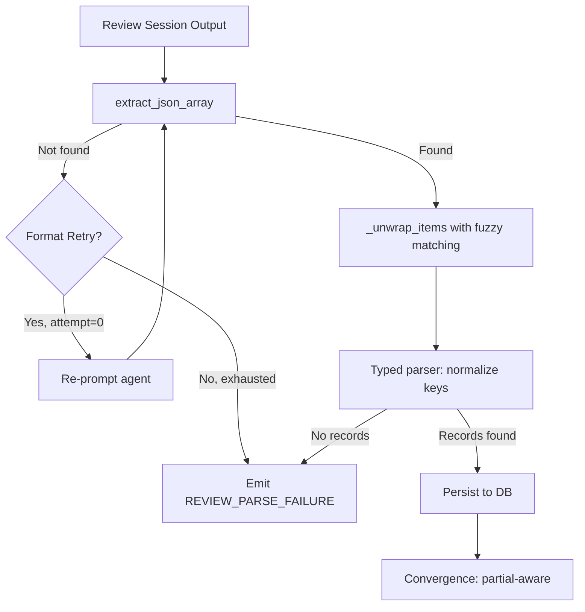

# Design Document: Review Parse Resilience

## Overview

Reduce the review archetype parse failure rate from 57% to <10% by applying
two complementary strategies: (a) stricter prompt instructions to reduce
output format variance, and (b) a more tolerant parser with a single-retry
fallback. Multi-instance convergence is updated to handle partial results.

Changes span three layers: prompt templates, the JSON extraction/parsing
pipeline, and the convergence logic.

## Architecture



### Module Responsibilities

1. **Prompt templates** (`agent_fox/_templates/prompts/{skeptic,verifier,auditor,oracle}.md`):
   Emit strict format instructions and negative examples.
2. **`agent_fox/core/json_extraction.py`**: Low-level JSON extraction from text
   (bracket-scan, fence extraction, truncation repair). No changes needed.
3. **`agent_fox/session/review_parser.py`**: Mid-level parsing — `_unwrap_items()`
   gains fuzzy key matching and case normalization.
4. **`agent_fox/engine/review_parser.py`**: Typed field-level parsing —
   `parse_review_findings()`, `parse_verification_results()`, etc. gain
   case-insensitive key normalization.
5. **`agent_fox/engine/review_persistence.py`**: Orchestrates extraction →
   parsing → persistence. Gains format retry logic.
6. **`agent_fox/session/convergence.py`**: Multi-instance convergence. Gains
   partial-result filtering at the call site (not inside convergence itself).

## Components and Interfaces

### Fuzzy Wrapper Key Matching

```python
# agent_fox/session/review_parser.py

# Canonical wrapper keys and their accepted variants
WRAPPER_KEY_VARIANTS: dict[str, set[str]] = {
    "findings": {"findings", "finding", "results", "issues"},
    "verdicts": {"verdicts", "verdict", "results", "verifications"},
    "drift_findings": {"drift_findings", "drift_finding", "drifts"},
    "audit": {"audit", "audits", "audit_results", "entries"},
}

def _resolve_wrapper_key(data: dict, canonical_key: str) -> str | None:
    """Find a matching wrapper key in data, case-insensitive with variants."""
    variants = WRAPPER_KEY_VARIANTS.get(canonical_key, {canonical_key})
    lower_map = {k.lower(): k for k in data.keys()}
    for variant in variants:
        if variant.lower() in lower_map:
            return lower_map[variant.lower()]
    return None
```

### Case-Insensitive Field Normalization

```python
# agent_fox/engine/review_parser.py

def _normalize_keys(obj: dict) -> dict:
    """Lowercase all keys in a dict (non-recursive, one level)."""
    return {k.lower(): v for k, v in obj.items()}
```

Applied in `parse_review_findings()`, `parse_verification_results()`,
`parse_drift_findings()` before field access.

### Format Retry

```python
# agent_fox/engine/review_persistence.py

FORMAT_RETRY_PROMPT: str = (
    "Your previous response could not be parsed as valid JSON. "
    "Please output ONLY the structured JSON block with no surrounding text, "
    "no markdown fences, and no commentary. Use exactly the field names "
    "from the schema provided in your instructions."
)

async def _attempt_format_retry(
    backend: AgentBackend,
    session_handle: SessionHandle,
) -> str | None:
    """Send a format retry message and return the response text, or None."""
```

The retry is implemented in the persistence layer. When `extract_json_array()`
returns `None` and the session is still alive, a single retry message is
appended to the session. The response is extracted and fed back through the
normal parsing pipeline.

### Partial Convergence

The convergence functions themselves (`converge_skeptic_records`,
`converge_verifier_records`, `converge_auditor`) are not modified. Instead,
the call site that collects instance results filters out `None`/empty results
before passing to convergence. This keeps convergence pure and testable.

## Data Models

### Audit Event Extensions

```python
# REVIEW_PARSE_RETRY_SUCCESS (new event type)
AuditEventType.REVIEW_PARSE_RETRY_SUCCESS

# REVIEW_PARSE_FAILURE payload additions
{
    "raw_output": str,        # existing (first 2000 chars)
    "retry_attempted": bool,  # new: True if retry was attempted
    "strategy": str,          # new: "bracket_scan,fence,retry"
}
```

### Wrapper Key Variants Map

```python
WRAPPER_KEY_VARIANTS: dict[str, set[str]] = {
    "findings": {"findings", "finding", "results", "issues"},
    "verdicts": {"verdicts", "verdict", "results", "verifications"},
    "drift_findings": {"drift_findings", "drift_finding", "drifts"},
    "audit": {"audit", "audits", "audit_results", "entries"},
}
```

## Operational Readiness

### Observability

- New audit event `REVIEW_PARSE_RETRY_SUCCESS` tracks successful retries.
- Enhanced `REVIEW_PARSE_FAILURE` payload includes `retry_attempted` and
  `strategy` fields for failure analysis.
- Existing warning logs are preserved; new warnings added for partial
  convergence and retry attempts.

### Rollout

- Prompt changes and parser tolerance are backward-compatible. Old transcripts
  remain parseable (parser is strictly more permissive).
- Format retry is additive — it only fires when existing parsing fails.
- No configuration changes required. No migration needed.

## Correctness Properties

### Property 1: Fuzzy Matching Subsumes Exact Matching

*For any* JSON object containing a key that exactly matches the canonical
wrapper key, `_resolve_wrapper_key()` SHALL return that key.

**Validates: Requirements 74-REQ-2.1, 74-REQ-2.2, 74-REQ-2.3**

### Property 2: Case Normalization Preserves Values

*For any* dict of string keys and arbitrary values, `_normalize_keys()` SHALL
produce a dict with the same number of entries (assuming no case-collision)
and identical values, differing only in key casing.

**Validates: Requirements 74-REQ-2.4**

### Property 3: Retry Bound

*For any* review session, the system SHALL attempt at most 1 format retry.
The total number of parse attempts is bounded by 2 (initial + 1 retry).

**Validates: Requirements 74-REQ-3.3, 74-REQ-3.E1**

### Property 4: Partial Convergence Monotonicity

*For any* set of N instance results where K instances (0 < K ≤ N) produce
parseable output, the convergence input SHALL contain exactly K result sets.
Adding a parseable instance never removes an existing one from the input.

**Validates: Requirements 74-REQ-4.1, 74-REQ-4.2, 74-REQ-4.3**

### Property 5: Parse Failure Event Correctness

*For any* review session, a `REVIEW_PARSE_FAILURE` event SHALL be emitted
if and only if all extraction strategies (including retry if attempted)
fail to produce at least one valid finding/verdict.

**Validates: Requirements 74-REQ-3.4, 74-REQ-3.E1, 74-REQ-5.2**

### Property 6: Variant Coverage

*For any* canonical wrapper key K and any variant V in
`WRAPPER_KEY_VARIANTS[K]`, a JSON object `{V: [...]}` SHALL be
successfully unwrapped by `_unwrap_items()`.

**Validates: Requirements 74-REQ-2.2, 74-REQ-2.3**

### Property 7: Backward Compatibility

*For any* JSON output that was successfully parsed by the pre-change parser,
the post-change parser SHALL also successfully parse it and produce
identical findings.

**Validates: Requirements 74-REQ-2.5**

## Error Handling

| Error Condition | Behavior | Requirement |
|----------------|----------|-------------|
| No JSON found in output | Attempt format retry (if session alive) | 74-REQ-3.1 |
| Format retry also fails | Emit REVIEW_PARSE_FAILURE, continue | 74-REQ-3.E1 |
| Session terminated before retry | Skip retry, emit REVIEW_PARSE_FAILURE | 74-REQ-3.E2 |
| All multi-instance parses fail | Emit REVIEW_PARSE_FAILURE, empty results | 74-REQ-4.E1 |
| Case-colliding keys in normalize | Last-write-wins (Python dict behavior) | 74-REQ-2.4 |

## Technology Stack

- Python 3.12+
- Existing modules: `json`, `re`, `logging`
- No new dependencies

## Definition of Done

A task group is complete when ALL of the following are true:

1. All subtasks within the group are checked off (`[x]`)
2. All spec tests (`test_spec.md` entries) for the task group pass
3. All property tests for the task group pass
4. All previously passing tests still pass (no regressions)
5. No linter warnings or errors introduced
6. Code is committed on a feature branch and pushed to remote
7. Feature branch is merged back to `develop`
8. `tasks.md` checkboxes are updated to reflect completion

## Testing Strategy

- **Unit tests**: Test fuzzy key matching, case normalization, variant
  resolution, retry prompt construction, and partial convergence filtering
  in isolation.
- **Property tests**: Use Hypothesis to verify Properties 1, 2, 4, 6, and 7
  across generated inputs (random key casings, variant names, partial
  instance sets).
- **Integration tests**: Feed representative review archetype outputs
  (including malformed variants observed in production) through the full
  extraction → parsing → persistence pipeline and verify correct findings
  are produced.
