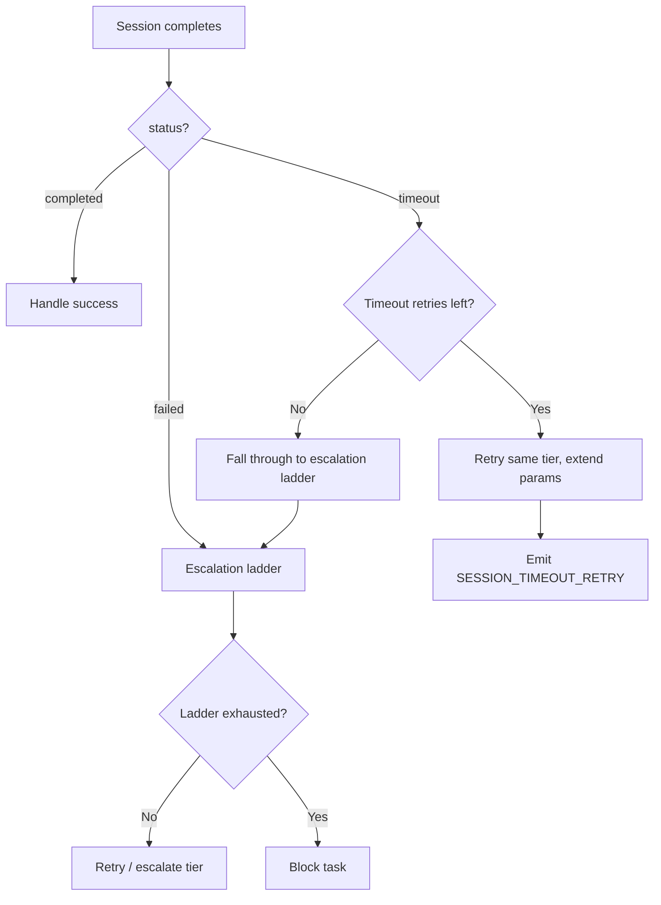

# Design Document: Timeout-Aware Escalation

## Overview

Adds timeout-specific retry handling to the escalation ladder. When a session
times out, the system retries at the same model tier with extended max_turns
and session_timeout, using a separate retry counter. If timeout retries are
exhausted, the failure falls through to the normal escalation ladder.

## Architecture



### Module Responsibilities

1. **`agent_fox/core/config.py`** (`RoutingConfig`): New fields
   `max_timeout_retries`, `timeout_multiplier`, `timeout_ceiling_factor`.
2. **`agent_fox/engine/result_handler.py`** (`SessionResultHandler`): New
   `_handle_timeout()` method, per-node timeout counter, extended parameter
   computation.
3. **`agent_fox/engine/session_lifecycle.py`**: Thread per-node timeout/turns
   overrides into `run_session()`.
4. **`agent_fox/knowledge/audit.py`**: New `SESSION_TIMEOUT_RETRY` event type.

## Components and Interfaces

### Timeout State Tracking

```python
# In SessionResultHandler.__init__
self._timeout_retries: dict[str, int] = {}  # node_id -> retry count
self._node_max_turns: dict[str, int | None] = {}  # per-node overrides
self._node_timeout: dict[str, int] = {}  # per-node timeout overrides
```

### Timeout Handler

```python
# agent_fox/engine/result_handler.py

def _handle_timeout(
    self,
    record: SessionRecord,
    attempt: int,
    state: ExecutionState,
    attempt_tracker: dict[str, int],
    error_tracker: dict[str, str | None],
) -> None:
    """Handle a timeout failure: extend params and retry, or fall through."""
    node_id = record.node_id
    current_retries = self._timeout_retries.get(node_id, 0)

    if current_retries >= self._max_timeout_retries:
        # Exhausted timeout retries — fall through to escalation
        logger.warning(
            "Timeout retries exhausted for %s (%d/%d), "
            "falling through to escalation ladder",
            node_id, current_retries, self._max_timeout_retries,
        )
        self._handle_failure(record, attempt, state, attempt_tracker, error_tracker)
        return

    # Extend parameters
    self._timeout_retries[node_id] = current_retries + 1
    self._extend_node_params(node_id)

    # Reset to pending for retry
    self._graph_sync.node_states[node_id] = "pending"
    # Emit audit event
    ...
```

### Parameter Extension

```python
def _extend_node_params(self, node_id: str) -> None:
    """Increase max_turns and session_timeout for the node."""
    multiplier = self._timeout_multiplier
    ceiling = self._timeout_ceiling_factor
    original_timeout = self._config.orchestrator.session_timeout

    # Extend timeout
    current_timeout = self._node_timeout.get(node_id, original_timeout)
    new_timeout = min(
        math.ceil(current_timeout * multiplier),
        math.ceil(original_timeout * ceiling),
    )
    self._node_timeout[node_id] = new_timeout

    # Extend max_turns (if not unlimited)
    current_turns = self._node_max_turns.get(node_id)
    if current_turns is not None:
        self._node_max_turns[node_id] = math.ceil(current_turns * multiplier)
```

### Configuration Fields

```python
# agent_fox/core/config.py - RoutingConfig additions

max_timeout_retries: int = Field(default=2)
timeout_multiplier: float = Field(default=1.5)
timeout_ceiling_factor: float = Field(default=2.0)
```

With validators: `max_timeout_retries >= 0`, `timeout_multiplier >= 1.0`,
`timeout_ceiling_factor >= 1.0`.

### Session Lifecycle Integration

The `NodeSessionRunner` (or equivalent dispatcher) must read per-node
overrides from the result handler's `_node_timeout` and `_node_max_turns`
dicts when launching a session, passing them to `run_session()` as
`session_timeout` and `max_turns` overrides.

## Data Models

### Audit Event

```python
AuditEventType.SESSION_TIMEOUT_RETRY  # new event type

# Payload schema:
{
    "timeout_retry_count": int,
    "max_timeout_retries": int,
    "original_max_turns": int | None,
    "extended_max_turns": int | None,
    "original_timeout": int,
    "extended_timeout": int,
}
```

### Config Schema Additions

```toml
[routing]
max_timeout_retries = 2       # 0 = disable timeout retries
timeout_multiplier = 1.5      # >= 1.0
timeout_ceiling_factor = 2.0  # >= 1.0
```

## Operational Readiness

### Observability

- New `SESSION_TIMEOUT_RETRY` audit event tracks each timeout retry with
  before/after parameter values.
- Warning log on timeout retry exhaustion documents the transition to
  escalation ladder handling.

### Rollout

- Default `max_timeout_retries = 2` changes behavior for timeout failures.
  To preserve old behavior, set `max_timeout_retries = 0`.
- No migration needed — new config fields have defaults.
- No breaking changes to existing interfaces.

## Correctness Properties

### Property 1: Timeout Never Triggers Escalation Directly

*For any* session with status `"timeout"` and timeout retries remaining,
the escalation ladder's `record_failure()` SHALL NOT be called.

**Validates: Requirements 75-REQ-1.1, 75-REQ-2.2**

### Property 2: Counter Independence

*For any* node experiencing a sequence of timeouts and logical failures,
the timeout retry counter and escalation ladder failure counter SHALL be
mutually independent — incrementing one SHALL NOT affect the other.

**Validates: Requirements 75-REQ-2.1, 75-REQ-2.E1**

### Property 3: Monotonic Parameter Extension

*For any* sequence of K timeout retries (K ≥ 1), the effective
`session_timeout` SHALL be non-decreasing across retries and SHALL never
exceed `original_timeout * timeout_ceiling_factor`.

**Validates: Requirements 75-REQ-3.2, 75-REQ-3.3, 75-REQ-3.E1**

### Property 4: Timeout Exhaustion Falls Through

*For any* node where `timeout_retries == max_timeout_retries`, the next
timeout SHALL invoke the escalation ladder's `record_failure()`.

**Validates: Requirements 75-REQ-2.4**

### Property 5: Unlimited Turns Preservation

*For any* node where `max_turns` is `None`, timeout retry SHALL NOT set
`max_turns` to a finite value.

**Validates: Requirements 75-REQ-3.4**

### Property 6: Configuration Validation

*For any* `RoutingConfig`, `max_timeout_retries` SHALL be >= 0,
`timeout_multiplier` SHALL be >= 1.0, and `timeout_ceiling_factor`
SHALL be >= 1.0.

**Validates: Requirements 75-REQ-4.4, 75-REQ-4.5, 75-REQ-4.6**

## Error Handling

| Error Condition | Behavior | Requirement |
|----------------|----------|-------------|
| Timeout with retries remaining | Retry same tier, extend params | 75-REQ-2.3 |
| Timeout retries exhausted | Fall through to escalation ladder | 75-REQ-2.4 |
| max_timeout_retries = 0 | Skip timeout handling, use escalation | 75-REQ-2.E2 |
| Extended timeout exceeds ceiling | Clamp to ceiling | 75-REQ-3.E1 |
| max_turns is None | Only extend timeout, not turns | 75-REQ-3.4 |
| timeout_multiplier = 1.0 | Retry with same params (no extension) | 75-REQ-4.E1 |

## Technology Stack

- Python 3.12+
- `math.ceil` for rounding
- Pydantic for config validation
- No new dependencies

## Definition of Done

A task group is complete when ALL of the following are true:

1. All subtasks within the group are checked off (`[x]`)
2. All spec tests (`test_spec.md` entries) for the task group pass
3. All property tests for the task group pass
4. All previously passing tests still pass (no regressions)
5. No linter warnings or errors introduced
6. Code is committed on a feature branch and pushed to remote
7. Feature branch is merged back to `develop`
8. `tasks.md` checkboxes are updated to reflect completion

## Testing Strategy

- **Unit tests**: Test timeout detection branching, counter independence,
  parameter extension math, ceiling clamping, and config validation in
  isolation.
- **Property tests**: Use Hypothesis to verify Properties 1-6 across
  generated sequences of timeout/failure events and config values.
- **Integration tests**: Simulate timeout → retry → success and
  timeout → retry exhaustion → escalation flows with mock backends.
