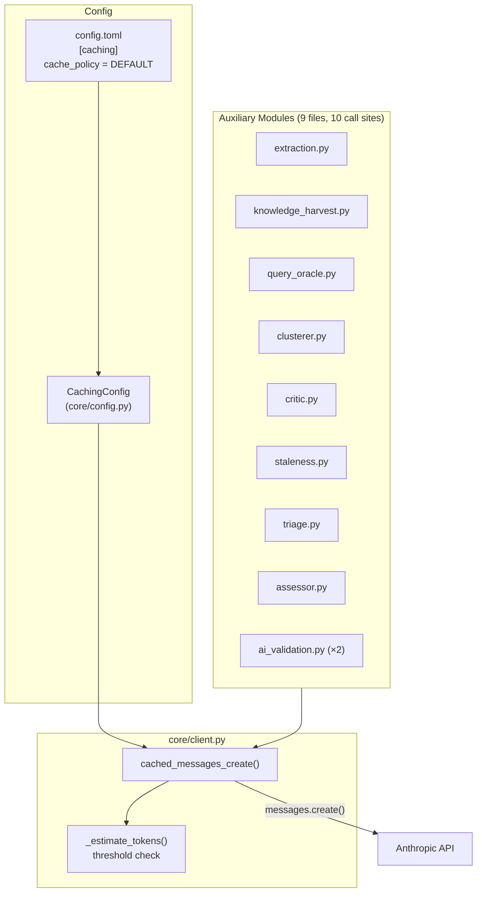

# Design Document: Prompt Caching

## Overview

Adds a thin caching layer between agent-fox's auxiliary modules and the
Anthropic Messages API. A `CachePolicy` enum and a `cached_messages_create()`
helper in `core/client.py` inject `cache_control` markers into system prompt
blocks based on a project-wide configuration. All 9 auxiliary modules are
migrated to call through this helper.

## Architecture



### Module Responsibilities

1. **`core/config.py`** — Owns `CachePolicy` enum and `CachingConfig` model;
   wired into `AgentFoxConfig`.
2. **`core/client.py`** — Owns `cached_messages_create()` helper and token
   estimation logic.
3. **Auxiliary modules** — Call `cached_messages_create()` instead of raw
   `client.messages.create()`.

## Components and Interfaces

### CachePolicy Enum

```python
class CachePolicy(str, Enum):
    NONE = "NONE"
    DEFAULT = "DEFAULT"
    EXTENDED = "EXTENDED"
```

### CachingConfig Model

```python
class CachingConfig(BaseModel):
    cache_policy: CachePolicy = CachePolicy.DEFAULT
```

Added to `AgentFoxConfig` as `caching: CachingConfig`.

### cached_messages_create()

```python
async def cached_messages_create(
    client: anthropic.AsyncAnthropic,
    *,
    model: str,
    max_tokens: int,
    messages: list[dict],
    system: str | list[dict] | None = None,
    cache_policy: CachePolicy = CachePolicy.DEFAULT,
    **kwargs,
) -> anthropic.types.Message:
    """Wrap client.messages.create() with cache_control injection.

    - If cache_policy is NONE, passes through unchanged.
    - If system is provided and above the token threshold, attaches
      cache_control to the last system block.
    - If system is a plain string, converts to content-block list first.
    - On cache_control-related API errors, retries without cache_control.
    """
```

A synchronous variant `cached_messages_create_sync()` is also provided
for the 3 sync callers (knowledge_harvest, query_oracle, clusterer).

### Token Estimation

```python
# Minimum tokens for caching to take effect
_CACHE_TOKEN_THRESHOLDS: dict[str, int] = {
    "claude-sonnet-4-6": 2048,
    "claude-opus-4-6": 4096,
    "claude-haiku-4-5": 4096,
}
_DEFAULT_THRESHOLD = 4096

def _estimate_tokens(text: str) -> int:
    """Rough token estimate: len(text) // 4."""
    return len(text) // 4
```

### cache_control Values

```python
_CACHE_CONTROL: dict[CachePolicy, dict | None] = {
    CachePolicy.NONE: None,
    CachePolicy.DEFAULT: {"type": "ephemeral"},
    CachePolicy.EXTENDED: {"type": "ephemeral", "ttl": "1h"},
}
```

## Data Models

### config.toml

```toml
[caching]
cache_policy = "DEFAULT"   # NONE | DEFAULT | EXTENDED
```

No other fields. The section is optional; omitting it uses DEFAULT.

## Operational Readiness

- **Observability:** Cache hit/miss is already tracked via
  `cache_read_input_tokens` and `cache_creation_input_tokens` in
  `ResultMessage` and cost accounting. No new metrics needed.
- **Rollback:** Set `cache_policy = "NONE"` in config.toml to fully
  disable. No code rollback required.
- **Migration:** No data migration. Config change is additive.

## Correctness Properties

### Property 1: Policy Fidelity

*For any* valid `CachePolicy` value and API request, the helper SHALL
attach the correct `cache_control` marker (or none) to the system prompt
block.

**Validates: Requirements 1.3, 1.4, 1.5, 2.2, 2.4**

### Property 2: String-to-Block Normalization

*For any* system prompt passed as a plain string, the helper SHALL produce
a single-element content-block list with the string as text and
`cache_control` attached (when policy ≠ NONE).

**Validates: Requirements 2.E1**

### Property 3: Threshold Gate

*For any* system prompt whose estimated token count is below the model's
minimum threshold, the helper SHALL not attach `cache_control`, regardless
of cache policy.

**Validates: Requirements 4.1, 4.2, 4.3**

### Property 4: NONE-Policy Passthrough

*For any* API request with `cache_policy=NONE`, the helper SHALL produce
a request identical to calling `client.messages.create()` directly (no
`cache_control` key in any content block).

**Validates: Requirements 2.4, 5.1**

## Error Handling

| Error Condition | Behavior | Requirement |
|----------------|----------|-------------|
| Unrecognized `cache_policy` value in config | Validation error at load time | 77-REQ-1.E1 |
| `cache_control` causes API error | Log warning, retry without caching | 77-REQ-2.E2 |
| Unknown model for threshold lookup | Use 4,096 default, log debug | 77-REQ-4.E1 |

## Technology Stack

- Python 3.12+
- `anthropic` SDK (existing dependency)
- Pydantic v2 (existing dependency, for config model)
- No new dependencies

## Definition of Done

A task group is complete when ALL of the following are true:

1. All subtasks within the group are checked off (`[x]`)
2. All spec tests (`test_spec.md` entries) for the task group pass
3. All property tests for the task group pass
4. All previously passing tests still pass (no regressions)
5. No linter warnings or errors introduced
6. Code is committed on a feature branch and pushed to remote
7. Feature branch is merged back to `develop`
8. `tasks.md` checkboxes are updated to reflect completion

## Testing Strategy

- **Unit tests:** Verify `CachingConfig` validation, `cached_messages_create()`
  marker injection, threshold gating, string normalization, and error retry.
  Use a mock/stub Anthropic client.
- **Property tests:** Hypothesis-driven tests for Properties 1–4 covering
  arbitrary system prompt strings, policy values, and model IDs.
- **Integration tests:** None required — the helper is a thin wrapper
  around an SDK call. End-to-end validation happens via existing cache
  token tracking in real runs.
