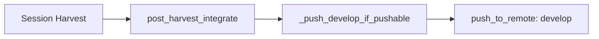

# Design Document: Local-Only Feature Branches

## Overview

This change simplifies `post_harvest_integrate()` by removing the feature
branch push. The function currently pushes both the feature branch and
`develop`; after this change it pushes only `develop`. All agent instruction
templates and skill templates are updated to match.

## Architecture



The feature branch push path (previously: `local_branch_exists` check →
`push_to_remote(feature_branch)`) is removed entirely.

### Module Responsibilities

1. **`workspace/harvest.py`** — `post_harvest_integrate()` pushes only
   `develop` to origin after harvest.
2. **`_templates/agents_md.md`** — Agent instructions template; updated to
   describe local-only feature branches.
3. **`_templates/skills/af-spec`** — Spec skill template; Definition of Done
   updated.

## Components and Interfaces

### `post_harvest_integrate` (modified)

```python
async def post_harvest_integrate(
    repo_root: Path,
    workspace: WorkspaceInfo,
) -> None:
    """Push develop to origin after harvest.

    Feature branches are kept local-only and are not pushed to the remote.
    The workspace parameter is retained for logging context.
    """
```

The function body is simplified to a single call:
`await _push_develop_if_pushable(repo_root)`.

### Template Changes

**`_templates/agents_md.md`** — Two sections updated:

- Git Workflow: Add "Feature branches are local-only — do not push them to
  origin." Remove "push the feature branch to origin" from Landing.
- Session Completion: Replace "The feature branch is pushed to `origin`" with
  "Changes are merged into `develop` locally."

**`_templates/skills/af-spec`** — Two lines updated:

- Definition of Done item 6: "Code is committed on a feature branch and merged
  into `develop`" (was "pushed to remote").
- Git-flow comment: Remove "push" from the flow description.

## Data Models

No data model changes.

## Operational Readiness

- **Observability**: The INFO log for develop push remains. The feature branch
  push INFO/WARNING logs are removed.
- **Rollback**: Revert the commit. No migration needed.
- **Compatibility**: Existing remote feature branches are unaffected.

## Correctness Properties

### Property 1: Post-Harvest Never Pushes Feature Branch

*For any* `(repo_root, workspace)` pair passed to `post_harvest_integrate`,
the function SHALL NOT call `push_to_remote` with `workspace.branch`.

**Validates: Requirements 78-REQ-1.1, 78-REQ-1.3**

### Property 2: Post-Harvest Always Pushes Develop

*For any* `(repo_root, workspace)` pair passed to `post_harvest_integrate`,
the function SHALL call `_push_develop_if_pushable(repo_root)`.

**Validates: Requirements 78-REQ-1.2, 78-REQ-1.E1**

### Property 3: Agent Template Contains No Feature Branch Push Instructions

*For any* version of `_templates/agents_md.md`, the content SHALL NOT contain
the phrases "pushed to `origin`" or "push the feature branch" in reference to
feature branches.

**Validates: Requirements 78-REQ-2.1, 78-REQ-2.2**

### Property 4: Spec Template Contains No Feature Branch Push Instructions

*For any* version of `_templates/skills/af-spec`, the content SHALL NOT contain
the phrase "pushed to remote" in the Definition of Done section.

**Validates: Requirements 78-REQ-3.1, 78-REQ-3.2**

## Error Handling

| Error Condition | Behavior | Requirement |
|----------------|----------|-------------|
| Feature branch already deleted | No effect — function no longer references it | 78-REQ-1.E1 |
| Develop push fails | Log warning, continue (unchanged from spec 65) | 65-REQ-3.5 |

## Technology Stack

- Python 3.12+
- asyncio (existing `push_to_remote` async function)
- No new dependencies

## Definition of Done

A task group is complete when ALL of the following are true:

1. All subtasks within the group are checked off (`[x]`)
2. All spec tests (`test_spec.md` entries) for the task group pass
3. All property tests for the task group pass
4. All previously passing tests still pass (no regressions)
5. No linter warnings or errors introduced
6. Code is committed on a feature branch and merged into `develop`
7. `tasks.md` checkboxes are updated to reflect completion

## Testing Strategy

- **Unit tests**: Verify `post_harvest_integrate` does not call
  `push_to_remote` with the feature branch. Verify it still calls
  `_push_develop_if_pushable`.
- **Property tests**: Template content assertions — verify no push-feature-
  branch instructions exist in agent or spec templates.
- **Integration tests**: Existing develop reconciliation tests remain valid
  and unchanged.
