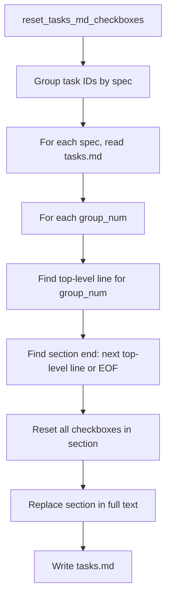

# Design Document: Hard Reset Sub-task Checkbox Reset

## Overview

This fix modifies the `reset_tasks_md_checkboxes()` function in
`agent_fox/engine/reset.py` to reset all checkboxes within each affected task
group's section, not just the top-level checkbox. The approach uses
section-based text processing: identify the text region for each task group,
then reset all `[x]` and `[-]` checkboxes within that region.

## Architecture



### Module Responsibilities

1. **`agent_fox/engine/reset.py`** — Contains `reset_tasks_md_checkboxes()`.
   The only file modified for the functional fix.
2. **`tests/unit/engine/test_hard_reset.py`** — Updated test to verify
   sub-task and nested checkbox reset behavior.
3. **`docs/errata/35_hard_reset_subtask_checkboxes.md`** — Erratum
   documenting the divergence from spec 35.

## Components and Interfaces

### Modified Function: `reset_tasks_md_checkboxes`

The function signature remains unchanged:

```python
def reset_tasks_md_checkboxes(
    affected_task_ids: list[str],
    specs_dir: Path,
) -> None:
```

### Algorithm Change

**Current approach** (top-level only):
```python
pattern = rf"^(- \[)[x\-](\] {group_num}\.)"
text = re.sub(pattern, r"\1 \2", text, flags=re.MULTILINE)
```

**New approach** (section-based):

1. Split the text into lines.
2. For each `group_num`, find the line index of the top-level checkbox
   (`^- \[.\] {group_num}\.`).
3. Find the end of the section: the next line matching `^- \[.\] \d+\.` or
   end of lines.
4. Within the section (from start line to end line), replace any `[x]` or
   `[-]` in checkbox patterns (`\s*- \[[x\-]\]`) with `[ ]`.
5. Reassemble the text.

The replacement regex for lines within the section:
```python
line = re.sub(r"^(\s*- \[)[x\-](\] )", r"\1 \2", line)
```

This matches any checkbox line at any indentation and resets `[x]` or `[-]`
to `[ ]`.

## Data Models

No data model changes. The function operates on plain text (tasks.md content).

## Correctness Properties

### Property 1: All Nested Checkboxes Reset

*For any* tasks.md content with a task group containing checkboxes at
multiple indentation depths, `reset_tasks_md_checkboxes` SHALL reset all
`[x]` and `[-]` checkboxes within that group's section to `[ ]`.

**Validates: Requirements fix04-REQ-1.1, fix04-REQ-1.2**

### Property 2: Other Groups Unaffected

*For any* tasks.md content with multiple task groups, resetting group N
SHALL leave all checkboxes in groups other than N unchanged.

**Validates: Requirements fix04-REQ-1.4, fix04-REQ-2.1**

### Property 3: Queued and Unchecked Preserved

*For any* tasks.md content, `reset_tasks_md_checkboxes` SHALL never modify
`[~]` or `[ ]` checkbox states.

**Validates: Requirements fix04-REQ-1.3**

### Property 4: Idempotent Reset

*For any* tasks.md content, applying `reset_tasks_md_checkboxes` twice with
the same arguments SHALL produce the same result as applying it once.

**Validates: Requirements fix04-REQ-1.1**

## Error Handling

| Error Condition | Behavior | Requirement |
|----------------|----------|-------------|
| No sub-tasks in group | Reset top-level only (existing behavior) | fix04-REQ-1.E1 |
| Non-checkbox content in section | Left unchanged | fix04-REQ-2.E2 |
| Last group in file | Section extends to EOF | fix04-REQ-2.E1 |

## Technology Stack

- **Language**: Python 3.12+
- **Standard library**: `re`, `pathlib`
- **Testing**: pytest, Hypothesis

## Definition of Done

A task group is complete when ALL of the following are true:

1. All subtasks within the group are checked off (`[x]`)
2. All spec tests (`test_spec.md` entries) for the task group pass
3. All property tests for the task group pass
4. All previously passing tests still pass (no regressions)
5. No linter warnings or errors introduced
6. Code is committed on a feature branch and pushed to remote
7. Feature branch is merged back to `develop`
8. `tasks.md` checkboxes are updated to reflect completion

## Testing Strategy

- **Unit tests** test `reset_tasks_md_checkboxes()` directly with crafted
  tasks.md content strings covering: sub-tasks reset, nested checkboxes
  reset, other groups preserved, queued states preserved, section boundaries.
- **Property tests** use Hypothesis to generate varied tasks.md structures
  and verify invariants: idempotency, other-group isolation, state
  preservation.
